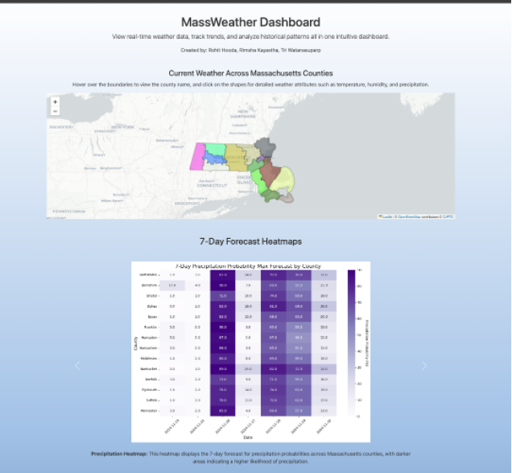

# DS5110-Final-Project
The main objective of this project is to build a robust data integration pipeline that merges weather data from multiple sources into a consistent and unified format. This process will ensure that the gathered data is structured and ready for analysis. Once the data is properly integrated, the next step will be to visualize current and forecasted weather features for Massachusetts counties. This will be achieved through interactive maps and charts, which will be displayed on a user-friendly website, allowing users to easily interpret and understand the weather forecasts.

# Project Structure 

- The **`Frontend`** folder contains the `index.html` and `index.js` files for building the dashboard and rendering charts. Additionally, it includes a `static` folder that houses all the heatmap images.

- The **`Backend`** folder includes the `app.py` file, a Flask API that manages multiple routes. It handles calls to third-party APIs and generates the Massachusetts county map, which the frontend utilizes for visualizations.

- The **`Pre-Processing`** folder contains data gathering, cleaning, and preparation scripts to make it suitable for visualizations.

- The **`Dataset`** folder includes both the raw unprocessed data and the cleaned dataset, which was processed using scripts from the Pre-Processing folder. 

- The **`API-Request`** folder contains a script for making OpenMateo API requests. When executed, this script stores the raw, unprocessed data in the **`Dataset`** folder, which is later processed by the scripts in the **`Pre-Processing`** folder.
 

# Weather Features Included in Our Dashboard
1. Temperature(min/max)
2. Humidity
3. Precipitation
4. Wind Speed/Direction
6. Gust Speed
7. UV Index
8. Air Quality Index
9. DayLight Duration
10. Sunlight duration


 # Steps to run the WebApp

 1. Open a new terminal 
 2. Type the following commands to run the server:
    ```bash
    cd Server
    python3 app.py
    ```
 3. Open another terminal and type the following commands to execute the front end:
    ```bash
    cd Frontend
    python -m http.server 5500
    ```
4. After you run the commands open a new browser tab and enter `http://127.0.0.1:5500/`
5. Finally, you should be able to see something like: 
